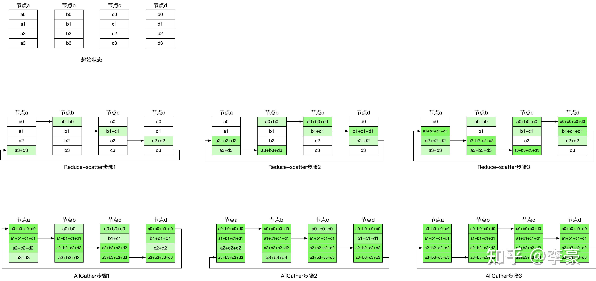
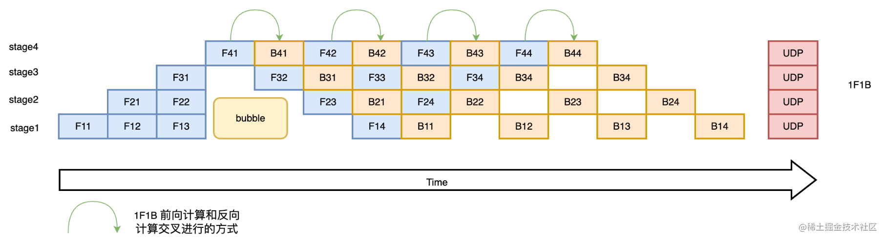
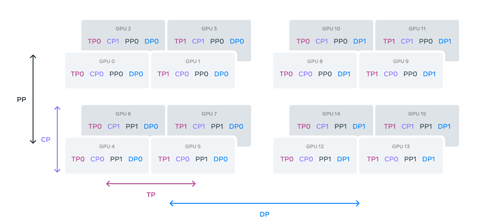

# LLM 基础知识

## 生成阶段
+ 关键参数
  + max_length / max_new_tokens: 最大生成 token 数量
  + temperature: 控制生成 token 的随机性，根据公式 $p_i=\frac{\exp(z_i/T)}{\sum\exp(z_j/T)}$，高温度使分布趋于平坦，低温度使分布趋于尖锐
  + top_k: 在每一步中仅从概率最高的 k 个 token 中采样
  + top_p: 累计概率达到 top_p 的最小 token 合集
  + do_sample: 是否使用采样策略，否则启用 Greedy-Search (完全确定化)
  + num_beams: Beam Search 中束的数量；如果 do_sample=False，那么执行非采样的 Beam Search，否则执行 Beam Search + Sampling
  + length_penalty / repetition_penalty: 额外惩罚

## 复杂度估算
+ 参数量
  + 词嵌入：$V * d$
  + Attention: Q/K/V/O 矩阵 $4d^2$
  + FFN: 两层 MLP $2 * d * 4d = 8d^2$
  + RMSNorm: 两个 $2d$
  + 输出层的 RMSNorm：$d$
  + LM Head: $d * V$
  + $L$ 层，共计: $2Vd + 12d^2L + (2L + 1)d$
+ 训练时间复杂度
  + 矩阵乘法复杂度：元素数量 * 单一元素计算复杂度
  + Attention 层：$n^2d$，其中 $n$ 是序列长度
  + FFN 层：$nd^2$
  + 总复杂度：$O(Ln^2d + Lnd^2)$
+ 推理时间复杂度
    + Attention 层：$n^2d$
    + FFN 层：$nd^2$
    + 总复杂度：$O(n^2d + nd^2)$, 没有改善
    + KV cache 降低的是 Projection 的复杂度，占用显存 2 * batch_size * num_layers * num_heads * head_dim * max_length * #(float)
+ 显存占用
  + 模型自身：参数量，float32 或者 float16
  + 优化器 (AdamW)：参数本身 float32，一阶动量 float32，二阶动量 float32，共计 3 * 参数量 * float32
  + 梯度值：参数量, float32 或者 float16
  + 激活值：不好直接刻画
    + Attention 层：$4 * batch_size * num_layers * num_heads * head_dim * ...$

## 并行化
+ 数据并行 (DP, DDP)
  + 每个 GPU 拷贝一份模型参数，处理相同 batch 的不同样本
  + 通过 AllReduce 汇总梯度
  
  + DeepSpeed-ZeRO 优化器
    + ZeRO-1: 优化器分片，每个 GPU 计算完整梯度，然后 AllReduce 汇总，再计算负责的参数更新，并 Broadcast 到全局
    + ZeRO-2: 优化器、梯度分片，每个 GPU 计算完整梯度，然后 Reduce-Scatter 分发各自部分的梯度，计算负责的参数更新，并 Broadcast 到全局
    + ZeRO-3: 优化器、梯度、参数分片
+ 流水线并行 (PP)
  + 不同 GPU 负责模型的上下层，但会导致 bubble 问题
  + 通过微批次 (micro-batch) 解决 bubble 问题
  
+ 张量并行 (TP)
  + 对于 $X * A$，行并行将 A 按行切开并将 X 按列切开，最后相加结果；列并行将 A 按列切开，最后 Concat 结果；
+ 上下文并行 (CP)
  + 将输入 token 进行切分，应对超长上下文的挑战
+ 混合并行
  

## 优化器
+ SGD + Momentum
  + Momentum: $v_t = \beta v_{t-1} + (1 - \beta) g_t$，其中 $g_t$ 是梯度
  + 更新：$w_t = w_{t-1} - \eta v_t$
+ AdaGrad
  + 更新：$w_t = w_{t-1} - \frac{\eta}{\sqrt{G_t + \epsilon}} g_t$，其中 $G_t$ 是历史梯度的平方和
  + 自适应学习率，但是当初始梯度很大、后续梯度很小的情况下，学习率会迅速减小，导致无法继续训练
+ RMSProp
  + 更新：$w_t = w_{t-1} - \frac{\eta}{\sqrt{G^2_t} + \epsilon} g_t$，其中 $G^2_t$ 是梯度平方的指数衰减平均
  + 避免了偶然梯度过大导致学习率迅速减小的问题
+ Adam
  + 更新：$m_t = \beta_1 m_{t-1} + (1 - \beta_1) g_t$，$v_t = \beta_2 v_{t-1} + (1 - \beta_2) g^2_t$，其中 $m_t$ 是一阶动量，$v_t$ 是二阶动量
  + 无偏估计：$m_t' = \frac{m_t}{1 - \beta_1^t}$，$v_t' = \frac{v_t}{1 - \beta_2^t}$
  + 更新：$w_t = w_{t-1} - \frac{\eta}{\sqrt{v_t'} + \epsilon} m_t'$
  + 通常使用 $\beta_1=0.9$ 和 $\beta_2=0.999$
+ AdamW
  + 更新：$w_t = w_{t-1} - \frac{\eta}{\sqrt{v_t'} + \epsilon} m_t' - \eta \lambda w_{t-1}$，其中 $\lambda$ 是权重衰减系数
  + 解决了 Adam 在训练大模型时的过拟合问题