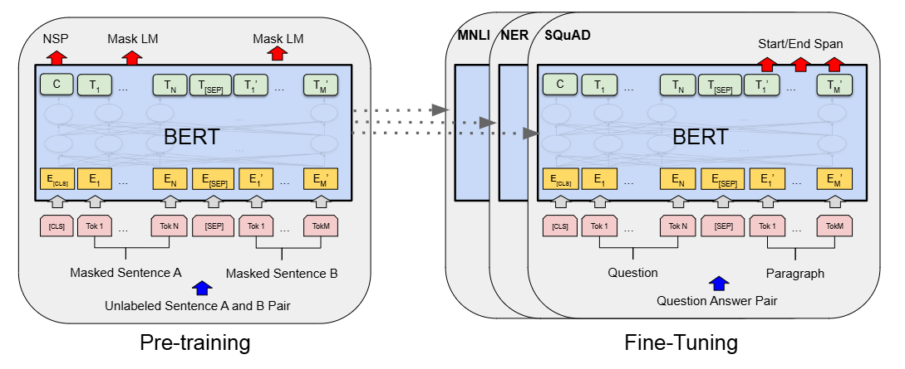

# BERT 架构学习

## 模型架构
+ Transformer Encoder-only 的架构方式，能够关注双向信息
  
+ 参数配置：层数 $L=12$，隐藏层维度 $H=768$，头数 $A=12$, token embedding 共计 30000 个，最长 $512$ token 数 (head-only, tail-only 或者 head+tail)
+ Encoder 架构获得的 Embedding 更加重要，使其更加适合做分类、总结、标签等任务，而非生成式任务
+ Input Embedding
  + Token Embedding
  + Segment Embedding：标记属于第一段话 (0) 还是第二段话 (1)
  + Position Embedding: 绝对位置编码

## 预训练任务
+ Masked LM：遮盖掉部分 token，用于预测，随机选择 15% 的 token 进行遮盖
  + 但是会导致 `[Mask]` 在预训练频繁出现，下游任务却不会出现，造成分布不一致
  + 因此对于选择的 15% token，80% 替换为 `[Mask]` ，10% 替换为随机 token，10% 保持不变
+ Next Sentence Prediction (NSP): 预测两个任务是否相邻，因为许多 QA 问答基于上下文关系的理解
  + 50% 的情况使用真实上下文，50% 的情况使用随机上下文
  + 模型进行 Binary Prediction

## 微调阶段
+ 直接替换掉 A&B 句就可以；对于单句任务，B 句可以置为空
+ 适用于 labeling (token 级) 或者 binary (只在 `[CLS]` 处对整句分类)

## RoBERTa: BERT 的复现优化工作
+ 在更大规模的数据上进行了训练
+ 移除掉 NSP Loss 能够提升模型表现
+ 在不同的 epoch 中，避免每次 mask 相同的 token，通过对原始数据进行复制实现