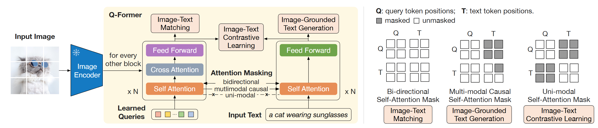
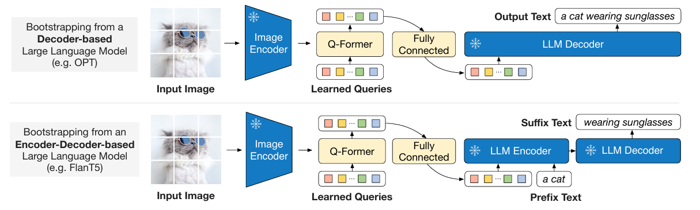

# BLIP 架构学习

## BLIP-2
+ 核心思想：将不同模态的信息进行融合，并转换为 LLM 能够理解的形式
+ 贡献：提出一个轻量级的 Q-former 模块进行特征融合，将 Image 和 Text Encoder 的参数全部冻结
+ Pre-training Stage 1
  + Query 共计 32 个，维度设置为 768
  + 图文对比学习 (Image-Text Contrastive Learning, ITC)，采用了 CLIP 的思想
  + Image-Text Matching (ITM Loss，二分类 task)，判断是否匹配
  + Image-Grounded Text Generation (ITG Loss, GPT-like)

+ Pre-training Stage 2
  + Generative Learning
