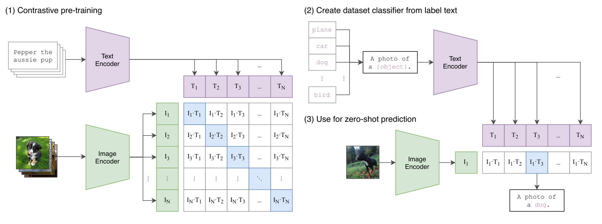
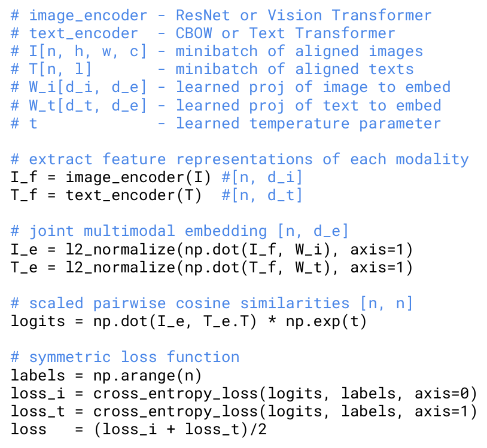

# CLIP 架构学习

## 整体架构
+ 通过对比学习的方式将文本与图像空间进行对齐
+ 采用对比学习而非生成式学习
  + 训练速度很慢
  + 类似图片的文本描述差异可以很大，难以准确预测

+ 没有解码器，因此适用于分类、匹配任务，而不是生成任务

## 模型架构
+ Text Encoder：Transforemr 架构，未采用预训练权重
+ Image Encoder：ViT 架构 / ResNet 架构，未采用预训练权重
+ 从 Encoder 至 embedding 仅采用线性变化
+ 温度系数可学习
+ text 通常只有一句话，image 只用了 resize 和 正方形裁剪
+ 损失函数计算 InfoNCE
  + 注意归一化、温度系数等因素
  
  