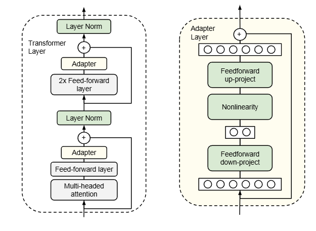
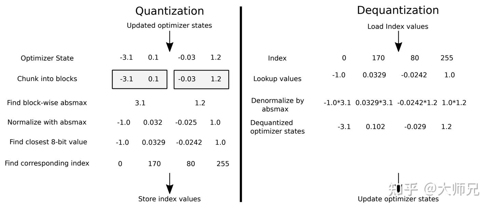
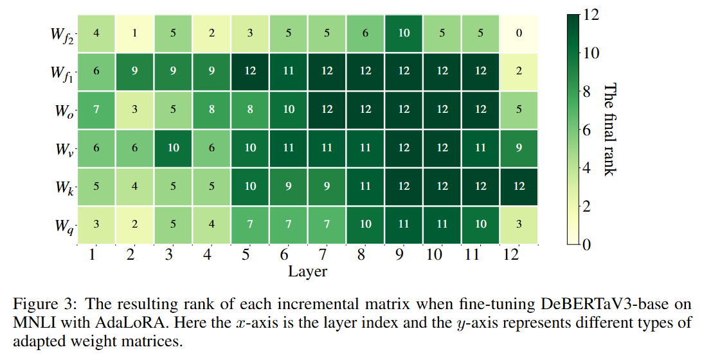

# 微调技术

## Adapter Tuning
+ 在 FFN 后添加 Adapter Layer
+ 缺陷：参数量较多 (1%-3%)，改变原有网络结构，并不高效
  

## Prefix-Tuning
+ 核心思想：在 Prompt 前添加一段**连续**的提示词进行微调
+ 方法：在**每一层**的 $K/V$ 矩阵前插入一个**独立**的矩阵 $P \in R^{dim\ * k}$
+ 注意事项
  + 随机初始化的效果可能不如用任务相关的真实词表进行初始化
  + 可以用 $MLP$ 将低维 Prefix 映射到高维，避免优化空间过大
  + 不需要对 $Q$ 添加 Prefix，$Q$ 属于发问者，不需要主动提问
  + 前缀长度控制在 几十-几百
  + 对于 Encoder-Decoder 架构，在 Encoder 和 Decoder 都需要添加 Prefix

## P-Tuning v1
+ 核心思想：Prompt 的设计对于模型的性能有很大的影响，因此通过微调 Prompt 来提升模型的性能。
+ 方法：通过**直接**在输入 Prompt 中添加一段可训练的 Embedding，并通过 LSTM 进行编码
+ 缺陷：任务泛化性差，对于实体标注任务表现差；规模不泛化，对于小于 10B 的模型微调效果差

## P-Tuning v2
+ 和 Prefix tuning 几乎一样
+ 差别
  + Prefix 的注入层级可以选择，在较高层级效果更好
  + 重参数化可以使用 LSTM
  + 在 Encoder 架构做分类任务效果更好

## LoRA (Low Rank Adaptation)
+ 核心思想：对**可训练的矩阵**添加低秩矩阵的适配器。
+ 计算公式：$W = W + \Delta W = W + BA$，其中$B \in \mathbb{R}^{d \times r}$，$A \in \mathbb{R}^{r \times d}$，$r \ll \min(d, h)$。
+ 初始化：$A$ 按照高斯初始化，$B$ 初始化为全 0，既能保证原始输出不发生变化，也能保证参数正常更新
+ 偏置项：默认不微调。
+ 缩放：$\frac{\alpha}{r}$，通常 $r=4, 8$，$\alpha=16$。
+ 微调层：$W_q$、$W_k$、$W_v$, $W_o$，也可以微调 Embedding 和 MLP 层。
+ 优势：无额外的推理延迟（因为$\delta W$可以直接加到$W$上），而之前的 Adapter tuning 以及 Prefix Tuning 都需要额外的推理延迟。

## QLora (Quantiaed LLM)
+ 核心思想：对进行训练的模型参数量化，16 bit -> 4 bit Normal Float；利用一部分内存代替显存；
+ 量化技术
  + 线性量化：
    + 对称量化：映射到 $[-127, 127]$, 公式 $r = Round(S(q-Z))$, 其中 $Z=0$, $S=\frac{2^{n-1}-1}{\max(|q|)}$, 满足**零点对应**
    + 非对称量化：映射到 $[0, 255]$, 公式 $r = Round(S(q-Z))$, 其中 $Z=\min(q)$, $S=\frac{2^{n-1}-1}{\max(|q|)-\min(|q|)}$
    + 对于极端值无法准确映射
  + 分块量化：对于 $W \in R^{m*n}$，对分块矩阵分别进行量化，公式相同，其中 $\max{(q)}$ 和 $\min(q)$ 是**真实数据**的值，对于块内的极端值无法准确映射
  + 分位数量化：将输入数据先排序再等分，之后进行量化，NF4 进行了均值为 0 的正态分布假设，因此避免了排序和等分的过程
    + 计算归一化常数 $N = \max(|q|)$，将输入数据归一化到 $[-1, 1]$ 之间
    + 计算分位点：$Q_i = \frac{1}{2}(Q_x(\frac{i}{2^k+1}) + Q_x(\frac{i+1}{2^k+1}))$, 其中 $k$ 为量化后的比特数，$i$ 代表分位点；由于正态分布的 0 分位点和 1 分为点为无穷，因此设置 **offset** 排除两端
    + 将分位点归一化到 $[-1, 1]$
    + 为每个值找到最相邻的分位点，保存 **index** 
    + 由于分位点是偶数个，因此无法实现**零点对应**
    
+ QLora 量化技术
  + 在分位数量化的基础之上，整数部分取 9 个量化值，负数部分取 8 个量化值，正负重叠的位置保留零点映射
  + 由于块大小为 64，归一化常数为 32bit，相当于额外占用了 $32 / (4 * 64) = 12.5\%$ 的空间存储归一化值，为此，每 256 个归一化值再做一次 8bit 量化，第二层归一化值为 32bit
+ QLora 推理：进行计算时，依然要将模型参数转换为 FP16；Lora 对应的系数一直以 FP16 存储
+ 可以实现 layer 级别的量化

## AdaLora
+ 核心思想：Lora 添加在不同层或者不同矩阵上，得到的微调效果并不相同，因此希望在重要的组件上采用更大的秩
+ 更新形式：$W = W + P\Lambda Q$，其中 $P$ 和 $Q$ 都是正交矩阵，$||P^TP - I||^2_F + ||Q^TQ - I||^2_F = 0$ 加入到损失函数当中，这种参数化形式避免了 SVD 分解消耗的时间
+ 相较于直接裁剪 Lora 的优势
  + 对于 Lora，一旦将秩降低，原始数值将无法恢复；而 AdaLora 只需要将特征值置为 0，特征向量依然保留；
  + 对于 Lora，不同行之间线性相关；对于 AdaLora，不同行之间正交，因此按照奇异值删除的效果更稳定；
+ 对 $\Lambda$ 的更新方式
  + 梯度更新
  + 重要性排名：$s(\lambda) + \frac{1}{d_1}\sum{s(P)} + \frac{1}{d_2}\sum{s(Q)}$，其中 $s(w) = |w\nabla_w L|$，表示特征值置为 0 后对损失函数的影响程度
  + 设置限额 $b$，在限额内的前 $b$ 个特征值保留，后续置为 0
  