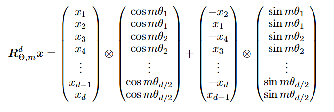

# Llama3 架构学习

## 整体架构

+ Decoder-only 架构
+ 预训练：8K - 128K 上下文长度分阶段训练
+ 后训练：SFT 以及 DPO 进行偏好对齐
+ 多模态：使用**对比学习**训练 Image Encoder，使用**自监督掩码**训练 Speech Encoder

## 模型架构
### Llama Model
+ Embedding layer
  + 初始化：高斯分布，对于 padding token 采用 **0** 初始化，与其目的一致 `module.weight.data[module.padding_idx].zero_()`
+ Decoder layer
  + RMSNorm
    + 采用了 Pre-Norm 的方式 (每个 block 最开始进行归一化)，有利于训练更加稳定
    + 公式：$x_i = \frac{x_i}{\sqrt{\frac{1}{d}\sum x_j^2 + \epsilon}} * \gamma_i$
    + 对于 $X \in R^{B*L*D}$，这个操作是在 $D$ 维度上进行的，也就是对每一个**词**进行归一化
    + $\gamma_i$ 是可学习参数，初始化设置为 1
    + 相较于 LayerNorm，具有更高的计算效率；由于隐向量基本满足 0 均值，因此没必要再去均值；而且没有 bias 需要训练
  + Rotary Embedding (RoPE)
    + 思想：将两个词的内积表达添加上相对位置信息 $g(x_m, x_n, m-n)$，通过引入**旋转矩阵**的方法恰好可以满足这个需求
    + 对于每个词而言，变换公式为 $Q = (W_qx_m)e^{im\theta} = R_{\theta}W_qx_m = R_{\theta}q_m$，$K = (W_kx_n)e^{in\theta} = R_{\theta}W_kx_n = R_{\theta}k_n$，其中 $\theta_i = 10000^{-2(i-1)/d}$
    
    + 具体计算上，为了加速，可以**两两分组**简化为如下形式
    
    + 相较于绝对位置编码 $p_{i, 2t}=\cos(\frac{i}{10000^{\frac{2t}{d}}})$, $p_{i, 2t+1}=\sin(\frac{i}{10000^{\frac{2t}{d}}})$，旋转位置编码刻画相对距离，有更好的外推泛化性
  + Group Query Attention
    + 采用了更少的 K/V head，以减少计算量和参数量；通过复制达到与 Q head 相同的数量
    + 训练时采用右 padding，推理时设置左 padding
  + KV cache
    + 在推理的过程中使用，缓存之前计算过的 K/V 值
    + 推理时，cache 可以设置为 1
    + 由于预测 next token 只需要前一个 Q 值，因此没有 Q cache
    + register_buffer 能够让非训练的常数随 model 移动到 GPU
    + nn.Sequential 自动顺序执行，nn.ModuleList 需要手动执行每一层，因此更加灵活
  + FFN (SwiGLU)
    + 采用了 Gate + FFN 的方式增强非线性
    + 激活函数采用 SiLu，门控添加了更多的非线性
    + 升维并非常见的 4 倍，为保持参数数量近似，约为 2.67 倍

### Pre Training
+ 采用 Cross-Entropy 损失函数

### Post Training
+ SFT + DPO

### 参数配置

### 多模态
+ 基本策略：Encoder + Cross Attention Adapter
