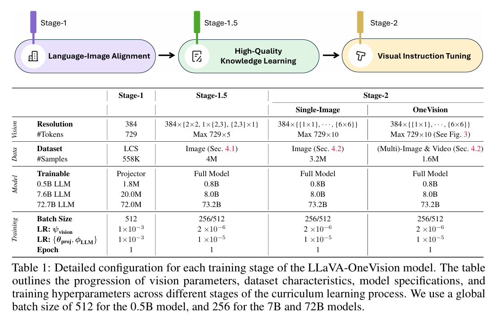

# LLAVA 架构学习

## 整体架构
+ 十分直接的架构模式，将 Image 特征对齐到 LLM 当中

## 训练方式
+ 图像处理：关键在于分辨率以及 token 数量，需要进行 performance 和 cost 的权衡
  + 保证分辨率的前提下，控制 Token 数量
  + 将一张大图分成 a * b 份，每份的分辨率设置为恒定值
  + 总的 Token 数量设置为上限 $\tau$，如果总 token 数量 $L = (a * b + 1)T > \tau$，那么将每份的 token 数量设置为 $\frac{\tau}{a * b + 1}$
  
+ 数据生成：大部分数据依赖合成，由预训练模型为图片生成描述，形成 (图片，指令，描述) 的样式
+ 训练过程
  + Stage-1: Language-Image Alignment：只用单图数据进行训练，且只训练 Projector
  + Stage-1.5: High-Quality Knowledge Learning：高质量合成数据，全量训练
  + Stage-2: Visual Instruction Tuning：多图、视频训练
  