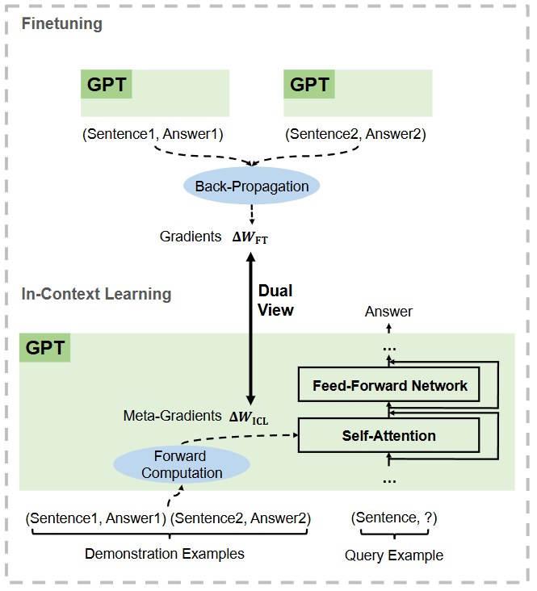
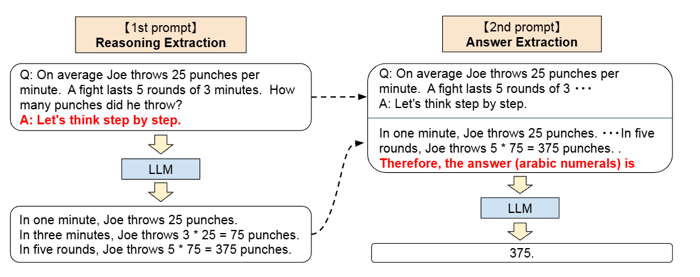
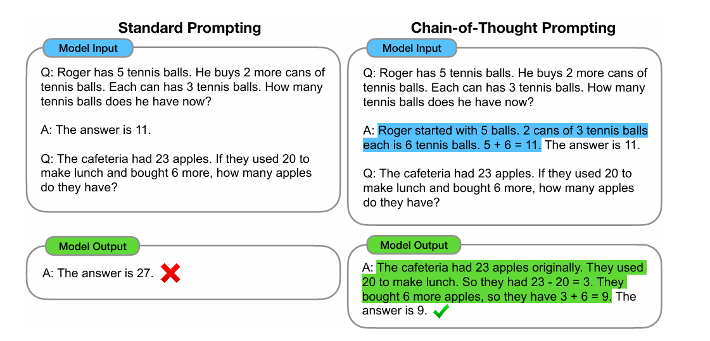
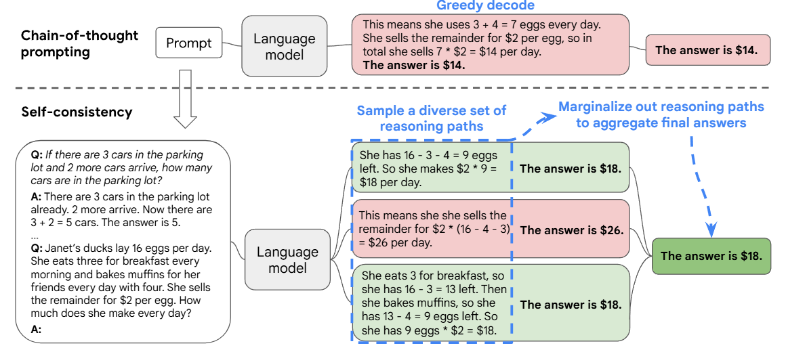
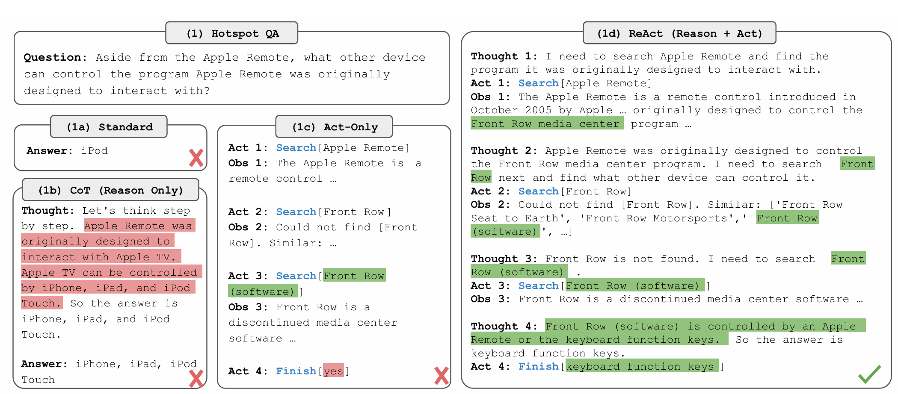
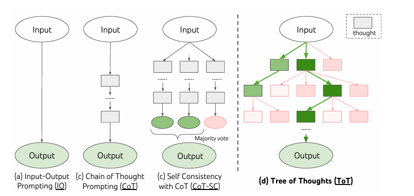

# 不微调的推理技术

## In-context Learning
+ 通过提供 Zero-Shot / One-Shot / Few-Shot 的示例，模型可以在推理时直接应用这些示例来生成答案，而不需要额外的训练步骤。
+ 理论解释：
  + Transformer 架构是 Meta-Learner
  + Few-Shot 使得 Attention 机制能够关注到示例中的相关信息，实现 implicit gradient descent
  

## Chain-of-Thought (CoT)
+ 通过提供一系列推理步骤的示例，模型可以在推理时生成类似的推理过程，从而提高答案的准确性。
  + 对于 Zero-Shot-CoT，通过添加 Let’s think step by step 的提示
  
  + 在**大模型参数**、数学推理问题、常识问答、符号推理等上有显著提升
  
+ 为了验证效果，采用了只输出数学公式、只进行额外长度的推理、将思维链置于答案之后的方式进行论证

## Self-Consistency
+ 通过生成多个答案并选择最常见的答案来提高模型的鲁棒性和准确性。
+ 对于最终的答案选择，**多数投票**相较于长度加权可以获得更好的效果
+ 相较于 CoT 有稳定提升
+ 相较于 Beam Search，多次采样生成的回答多样性和丰富性更高，因此效果更好
  + 故采样时 $T$ 设置的更大

## ReAct
+ Reasoning + Action，相当于将 CoT 与 ToolUse 结合起来

## Tree-of-Thought (ToT)
+ 通过将思维过程组织成树状结构，模型可以更好地探索不同的推理路径，从而提高推理的灵活性和准确性。

+ 主要流程
  + Thought Decomposition：将将中间推理过程划分为多个“思维单元”
  + Thought Generation：根据当前状态 $s = [x, t_{1}, t_{2}, \ldots, t_{n}]$ 生成新的思维单元 $t_{n+1}$，其中 $x$ 是输入，$t_{i}$ 是之前的思维单元；根据问题不同，多个思维的生成可以用 iid 的 CoT 或者一轮生成多个思维单元。
  + State Evaluation：对当前状态 $s$ 进行评估，判断应该保留哪些状态；可以采用逐个评分或者排名的方式。
  + Search Algorithm：BFS (控制 beam size 恒定)、DFS (及时剪枝、回溯) 以及其他的启发式算法