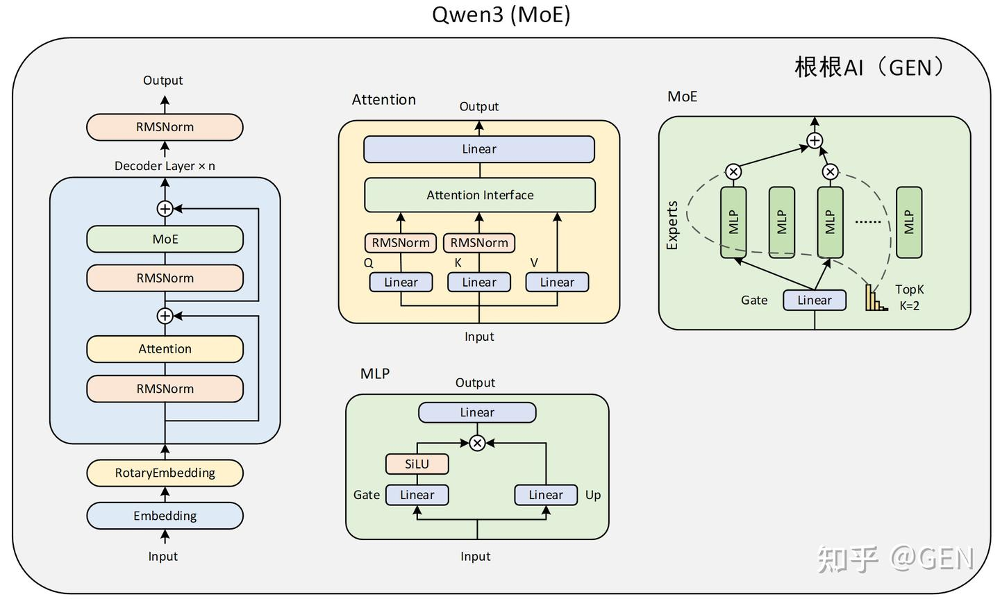

# Qwen3 架构学习

## 模型架构
+ 与 llama3 很类似
+ 主要变化
  + 实现了 MoE 架构
  + 对 Q/K 矩阵进行了 RMS-LayerNorm，替代了 Q/K/V bias
  
+ MoE
  + 利用专家层替代 FFN，每次推理时只激活部分专家
  + 通过 softmax 选择候选专家，归一化后对多个专家的结果进行加权 (Qwen3 中默认专家独享)
  + 添加额外的路由损失函数