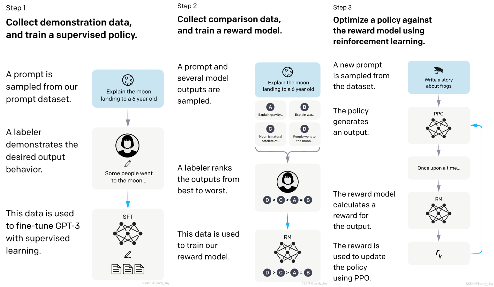
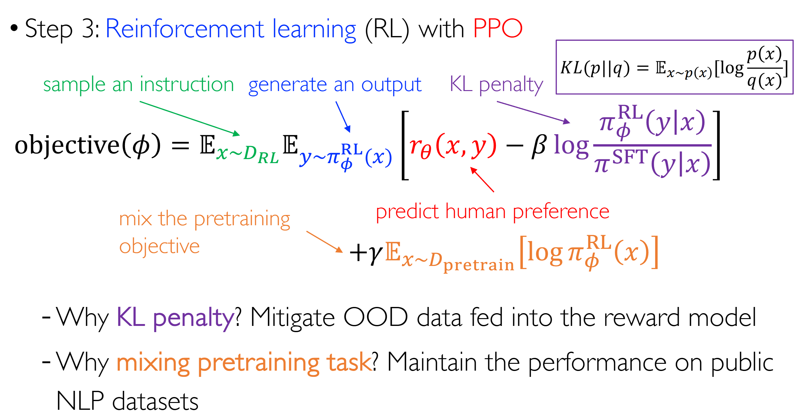
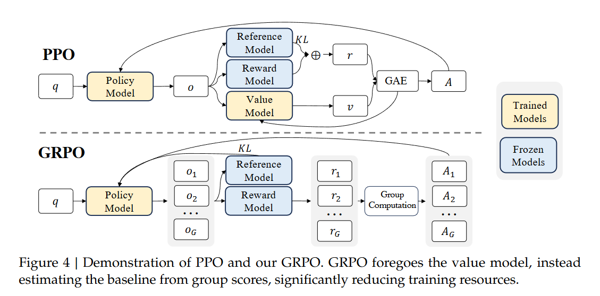
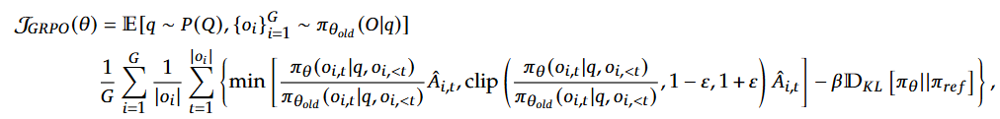

# Reinforcement Learning From Human Feedback

## InstructGPT (RLHF + PPO)
+ 整体流程：SFT -> RM Model Training -> PPO Training
  
+ 阶段 1: 收集 (Instruction, Output) 对用于 SFT 微调 Base 模型，微调方式多种多样，采用 Cross-Entropy 损失函数
+ 阶段 2: 基于 SFT Model 训练 Reward Model，采样一个 Instruction，生成 K=4-9 个 output，并由专家进行排序；将 output 可以组成 $C_K^2$ 个 pairs，作为一个 Batch 输入给 Reward Model，让模型能够学习偏好。损失函数 $L=-\frac{1}{C_K^2}E[\log(\sigma(r(x, y_w) - r(x, y_l)))]$，其中 $\sigma$ 是 sigmoid 函数
+ 阶段 3: 基于 SFT Model 进行 PPO 训练，在 LLM 的语境下，action 表示为**下一个 token**，policy 表示为 **下一个 token 的概率分布**，reward function 可以建模为 $r(x, y) = r_{\phi}(x, y) - \beta(\log\pi_{\theta}(y|x) - \log\pi_{ref}(y|x))$
  
+ 涉及模型：Actor Model，Critic Model，Reward Model，Reference Model

## DPO (Direct Preference Optimization)
+ 核心思想：无需显示的奖励建模或者强化学习
+ 推导过程
  + 沿用了 PPO 的偏好模型 $p(y_1>y_2|x) = sigmoid(r(y_1,x)-r(y_2,x))$
  + 根据 PPO Step3 对于 $\pi_{\theta}$ 的最优化目标，可以得到 $\pi_{\theta}^*$ 与 $r$ 的关联 $r(x,y)=\beta\log\frac{\pi_{\theta}^*(y|x)}{\pi_{ref}(y|x)}+\Phi(x)$
  + 将其代入偏好模型中，即可得到最优策略下的偏好概率 $p^*(y_1>y_2|x) = sigmoid(\beta\log\frac{\pi_{\theta}^*(y_1|x)}{\pi_{ref}(y_1|x)}-\beta\log\frac{\pi_{\theta}^*(y_2|x)}{\pi_{ref}(y_2|x)})$
  + 通过最大化似然估计可以得到损失函数 $L_{DPO} = -E_{(x, y_w, y_l)}[\log\sigma(\beta\log\frac{\pi_{\theta}^*(y_w|x)}{\pi_{ref}(y_w|x)}-\beta\log\frac{\pi_{\theta}^*(y_l|x)}{\pi_{ref}(y_l|x)})]$
  + 即便对于 “单个问题-多个回答” 的情况，使用 $p(\tau|y_1, ..., y_n, x)=\prod_{i=1}^n\frac{\exp(r(x, y_{\tau_i}))}{\sum_{j=i}^n\exp(r(x, y_{\tau_j}))}$ 即可，表示这一顺序的概率
+ 直观理解：$\nabla L=-E_{(x, y_w, y_l)}[\sigma(r_{\theta}(x, y_l)-r_{\theta}(x, y_w))[\nabla\log\pi(y_w|x) - \nabla\log\pi(y_l|x)]]$
  + 增强 good 样本的似然，弱化 bad 样本的似然
  + 当奖励预测不正确时，给予更高的权重
+ 涉及模型：Policy Model, Reference Model
+ 初始化：SFT 模型或者 ${y_w}$ 最大化似然估计

## GRPO (Group Relative Policy Optimization)
+ 核心思想：去除掉 PPO Actor-Critic 框架中的 Critic Network，减少显存占用
  
+ 方法：Critic Network 的作用是评估 baseline reward 以减少 variance
  + 对于同一个问题 $x$，生成一组回答 $\{y_i\}$，通过一组回答奖励 $\{r_i\}$ 的均值进行归一化
    + 对于 ORM，$A_{i,t}=r_i=\frac{r_i-mean(r)}{std(r)}$
    + 对于 PRM，$r_i^{index(j)}=\frac{r_i^{index(j)}-mean(R)}{std(R)}$，$A_{i,t}=\sum_{j \geq t}r_i^{index(j)}$
  + 对于 KL 散度的计算，不同于 PPO 将其融入到**每步** reward 中，GRPO 直接将其添加到目标函数中，并采用了无偏估计 $KL[\pi_{\theta}||\pi_{ref}]=\frac{\pi_{ref}(y_{i,t|x,y_{i,<t}})}{\pi_{\theta}(y_{i,t|x,y_{i,<t}})}-\log\frac{\pi_{ref}(y_{i,t|x,y_{i,<t}})}{\pi_{\theta}(y_{i,t|x,y_{i,<t}})}-1$，保持恒正
+ 损失函数：
  
