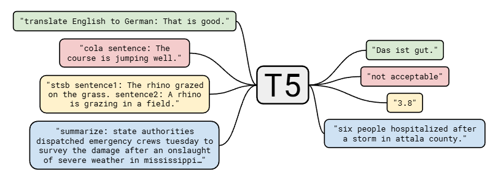
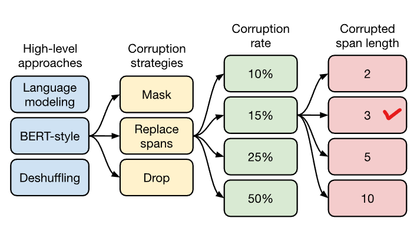
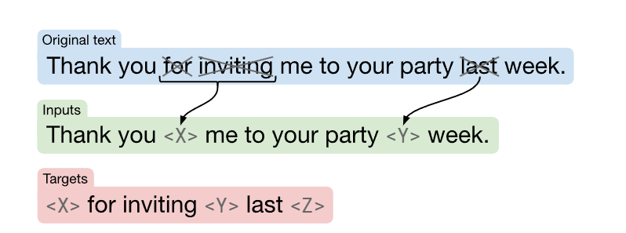
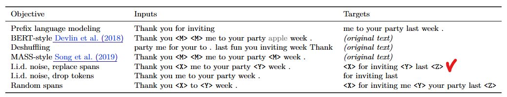

# T5 架构学习

## 模型架构
+ 将所有任务统一为 text-to-text 的形式，通过添加任务相关的 text-prefix 实现
+ 相同的模型，相同的损失函数，相同的训练过程，完成多种任务
  

## 预训练方式
+ 通过遍历确定最佳的预训练方式，与 BERT 类似
  
+ 训练数据构造方式
  
+ 各种训练方式对比
  + 对比模型架构：Encoder-Deocder (√) / Decoder-only / Prefix-LM
  + 对比预训练目标：Generation / BERT-style / Shuffle ...，最终选择 Bert Style 模式且推理最短的方式
       
  + 对比训练方式：掩码比例、掩码长度
  + 对比训练数据集和数据及大小：清洗后数据、大数据集
  + 对比 fine-tuning 方式：全量微调
  + 对比多任务学习方式
    + 数据集混合，采样概率与样本量成正比 $r_m=\frac{\min(e_m, K)}{\sum\min(e_j, K)}$，修正 $r_m = \frac{r_m^{1/T}}{\sum r_j^{1/T}}$，或者均匀采样
    + 结果上看，预训练 + 微调的方式最好，修正后的采样方式次之
  + 对比预训练+微调方式
    + Baseline: 先预训练，后微调
    + Multitask：将微调任务引入到预训练当中
    + Multitask + fine-tuning：大杂烩
    + Leave-one-out：将一个下游任务排除在外
    + Supervised：完全监督学习 (×)
  + 对比模型规模
    + 优先扩大模型规模和训练时间