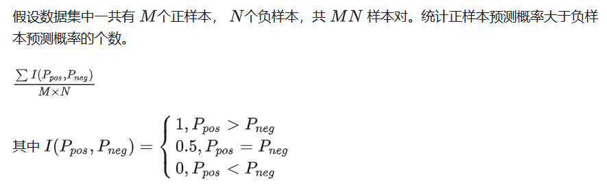

# 搜广推 day1

## 组成

+ 物品：数量庞大，面临长尾分布的问题、新产品与旧产品的问题；
+ 用户：要满足用户的搜索、推荐体验；

## 搜广推的差异

+ 广告：优化目标通常为 CTR (Click-Through-Rate) 和 CVR (Conversion-Rate)，这是由于广告计价模式与点击率直接相关；数值上的“精准”几乎是唯一的要求；广告的出现形式通常为单个出现，因此仅 point-wise 优化；模型上，sequence 效应不强，更需要 attention 机制；
  + 注意：CTR 真实值应该根据大数定律得到，但在现实当中，事件只发生一次，因此 CTR 的真实值无法获得；
  + 退而求其次，假设 CTR 符合 Bernoulli 分布，预测点击的概率；
+ 推荐：推荐的预测指标不尽相同，包括点击率、观看时长等；由于推荐结果通常为一个列表，因此可以使用 AUC 作为评价指标；包括 point-wise、list-wise、page-wise 等优化；模型上，要把握用户的兴趣变化，sequence 通常有帮助；
  + 注意：AUC 只反映了排序结果的好坏；
  + AUC 计算公式：
+ 搜索：由于搜索存在正确答案，因此对于召回率十分关注 (精确率、F1-score 也关注)；关键在于文本的 Embedding 效果；模型上，搜索词和 item 是天然的双塔结构，搜索词与其他特征的特征交叉十分重要；
  + 精确率：提取出的正确信息条数 /  提取出的信息条数
  + 召回率：提取出的正确信息条数 /  样本中所有正确的信息条数
  + F1-score：正确率 * 召回率 * 2 / (正确率 + 召回率) 