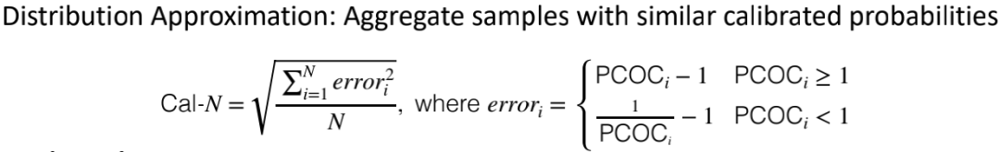
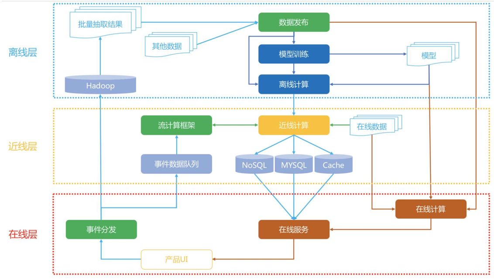
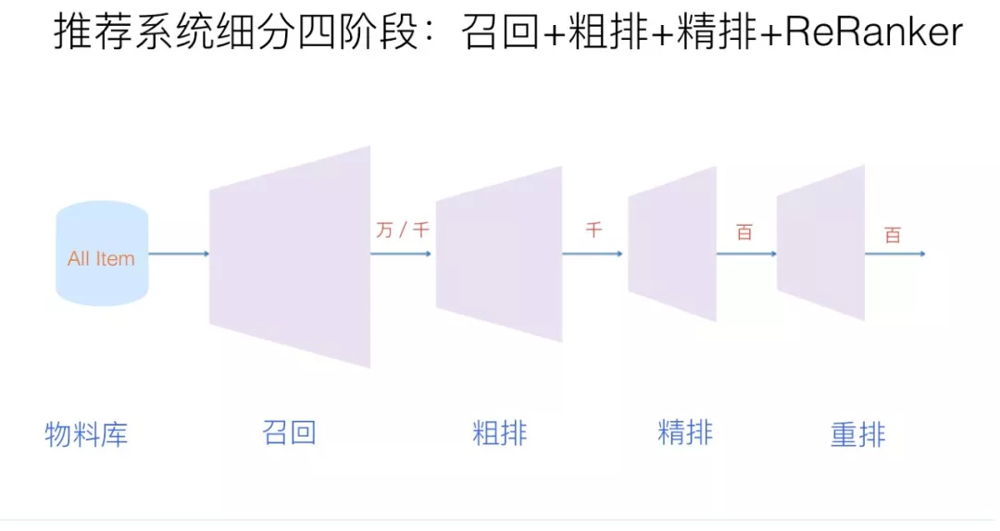
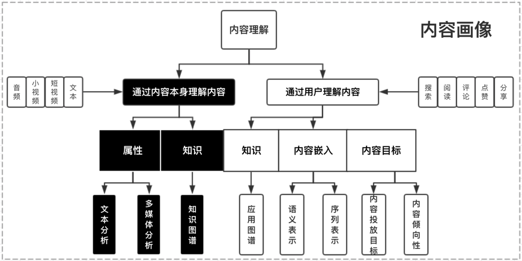

# 搜广推 day1

## 组成

+ 物品：数量庞大，面临长尾分布的问题、新产品与旧产品的问题；
+ 用户：要满足用户的搜索、推荐体验；

## 搜广推的差异

+ 广告：优化目标通常为 CTR (Click-Through-Rate) 和 CVR (Conversion-Rate)，这是由于广告计价模式与点击率直接相关；数值上的“精准”几乎是唯一的要求；广告的出现形式通常为单个出现，因此仅 point-wise 优化；模型上，sequence 效应不强，更需要 attention 机制；
  + 注意：CTR 真实值应该根据大数定律得到，但在现实当中，事件只发生一次，因此 CTR 的真实值无法获得；
  + 退而求其次，假设 CTR 符合 Bernoulli 分布，预测点击的概率；
  + 负样本远多于正样本，通常采样到 1：10 附近的比例；
  + 为了让预测 CTR 接近真实 CTR，采用后验校准技术（保序回归平滑校准：分桶、保序回归、线性插值）
  + 校准评价指标：
    + PCOC：校准之后的点击率与后验点击率（近似真实概率）的比值，越接近于1，意味着在绝对值上越准确，大于1为高估，小于1为低估；但是整体上的 PCOC 由于抵消，意义并不显著；
    + Calibration-N (Cal-N)：分桶计算 PCOC 偏差；
+ 推荐：推荐的预测指标不尽相同，包括点击率、观看时长等；由于推荐结果通常为一个列表，因此可以使用 AUC 作为评价指标；包括 point-wise、list-wise、page-wise 等优化；模型上，要把握用户的兴趣变化，sequence 通常有帮助；
  + 注意：AUC 只反映了排序结果的好坏；
  + AUC 计算公式：
+ 搜索：由于搜索存在正确答案，因此对于召回率十分关注 (精确率、F1-score 也关注)；关键在于文本的 Embedding 效果；模型上，搜索词和 item 是天然的双塔结构，搜索词与其他特征的特征交叉十分重要；
  + 精确率：提取出的正确信息条数 /  提取出的信息条数
  + 召回率：提取出的正确信息条数 /  样本中所有正确的信息条数
  + F1-score：正确率 * 召回率 * 2 / (正确率 + 召回率) 
  
## 推荐系统架构

+ 系统架构
  + 离线层：存储离线数据，模型训练等；不使用在线数据，不提供实时响应；最接近学生理解的模型训练过程；
  + 近线层：使用在线数据，但不提供实时响应；
    + 可以将用户的实时数据存储下来，例如 DIN 等模型的输入需要利用实时用户数据和历史数据；
    + 在线学习等模型需要利用实时数据；
  + 在线层：使用实时数据，提供实时响应；
    + 用户和商品特征是离线层计算好的，存储在数据库中；
    + 在线层完成快速的特征拼接，输入近线层或者离线层的模型，得到输出结果；

+ 算法架构
  + 召回：千万级 item -> 万级 item
    + 原始 item 物料库太大，在线排序阶段无法对所有的 item 进行打分排序；
    + 考虑全面性、召回率高；准确性不做要求；
    + 考虑用户兴趣的多元化、场景的多元化；考虑系统鲁棒性；
  + 粗排：万/千 item -> 千 item
    + 类似精排，曝光未点击为负样本，曝光点击为正样本；
    + 利用精排阶段的特征对 item 进行打分；考虑 user 对 item 的个性化偏好；
  + 精排：千 item -> 百 item (允许时延最长的部分)
    + 以 ctr、cvr 等为目标，优化排序结果；
    + 与用户特征关联紧密；考虑数据规模和数据的时效性；
  + 重排：百 item -> 百 item
    + 精排 point-wise 优化，容易造成同质化严重；重排考虑 point-wise、pair-wise、list-wise，考虑了物品之间的相互影响；
    + 可以用 NDCG 作为评价指标 (但更多的用于搜索当中)
      + CG：$CG_p = \sum_{i=1}^{p}rel_i$
      + DCG：$DCG_p = \sum_{i=1}^{p}\frac{rel_i}{log_2(i+1)}$
      + IDCG：相关性最高的 p 个 item 的 DCG
      + NDCG：$NDCG_P = \frac{DCG_p}{IDCG_p}$

## 推荐系统技术栈

+ 物料库 (画像层)：主要是 Embedding 的计算
  + 用户画像：年龄、爱好等
  + item 画像：文本理解、关键词、内容理解等；

+ 召回/粗排：
  + 经典模型召回 (user 和 item Embedding 的匹配程度)
  + 序列模型召回：考虑用户的历史行为序列
  + 用户兴趣拆分：根据用户的多兴趣设置不同的 Embedding
+ 精排：
  + 特征交叉模型：进行显式的特征交叉；
  + 序列模型：利用用户的历史行为序列构造 user Embedding；
  + 多模态信息：图文特征融合；
  + 多目标学习：同时优化 CTR、CVR 等等指标；
  + 强化学习：可以灵活定义任务目标；