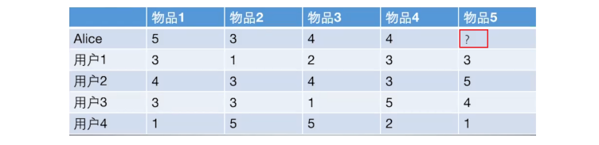
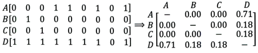
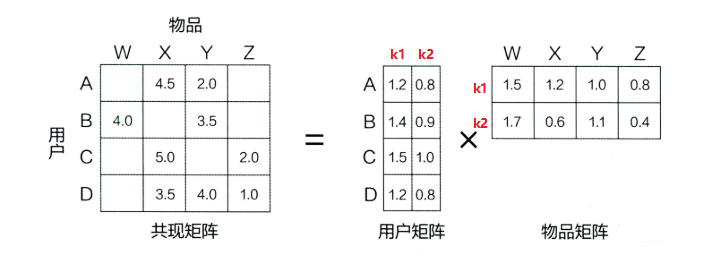
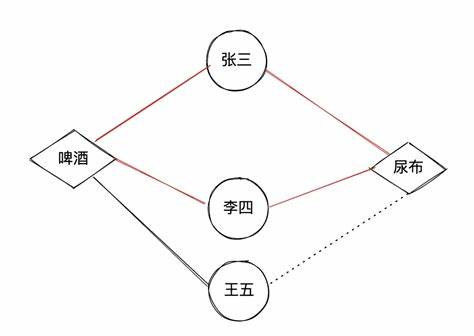
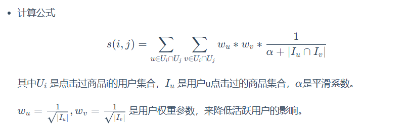

# 搜广推 day2

## 协同过滤召回 (Collaborative Filtering)

基于用户历史行为数据挖掘用户的喜爱偏好，并预测用户可能喜爱的产品。

+ UserCF (用户协同过滤) (判断用户的相似度)
  + 算法流程
    + 根据已有打分情况 (用户 Embedding)，找到与 user_0 最相关的 K 个 user；
    + user_0 对于 new item 的打分使用 K 个 user 的加权平均获得 (优化：对所有 user 的打分减去均值)；
  + 缺点
    + 用户购买的重叠度低，难以寻找相似用户；
    + 用户相似度的计算开销很大；
  + 评价指标：召回率、精确率、覆盖率 (所有推荐的商品占商品总数的比例)、新颖度

+ ItemCF (物品协同过滤) (基于历史用户的行为判断物品的相似度)
  + 算法流程
    + 根据已有打分情况 (物品 Embedding)，找到与 new item 最相关的 K 个 item；
    + 利用 user_0 对于最相关的 K 个 item 的打分，加权计算得到对 new item 的打分 (优化：对每个 item 的打分减去均值)；
  + 算法问题
    + 热门物品与其他物品总是相似的，因此热门物品大量推荐；而冷门物品特征向量稀疏，很少推荐；
    + 无法将两个物品的相似推广到其他物品上；
    + 改进：矩阵分解技术 (稀疏矩阵 -> 稠密矩阵)

+ MF (矩阵分解) (相当于为 user 和 item 构造一个 Embedding)
  + 算法流程：如图所示，转换为高维矩阵重建问题即可；
  + 算法问题
    + 只考虑了评分矩阵，没有考虑 user、item、context 等特征；
    + 对于没有历史行为的用户，无法冷启动；

+ Swing (构建 user-item 二部图捕获产品间的相似关系)
  + Swing 算法：利用用户的购买行为计算商品之间的相似性；
    + 用户点击 item 次数越多，其权重越低；**目的是避免活跃用户主导推荐系统的相似度计算**。

  + Surprise 算法：利用用户的点击行为捕捉商品之间的互补性 **(难以描述，请看原论文 Swing.pdf)**；
    + Relevance of Category-level: 利用按时间排序后的用户的购买数据，计算产品种类之间的互补相关性；并利用断崖图判断互不相关性最高的品类；
    + Relevance of Product-level: 利用两个产品之间购买的时间先后顺序和**时间间隔**，计算两个产品之间的互补相关性 (只针对相关的 Category 进行计算)；
    + Relevance of Cluster-level: 只有多次出现 a -> b 的购买记录，系统才认为有高置信度；但由于购买数据的稀疏性，co-purchasing 数据十分匮乏；
      + Clustering using label propagation: 采用标签传播的机制进行产品聚类；相关性由 Swing 算法给出；每次有一定概率选择相关性最高的品类作为自己的标签；
      + Cluster-level relevance: 利用 Relevance of Product-level 计算 Cluster 之间的互补相关性；
    + Surprice score: 由 Relevance of Product-level 以及 Relevance of Cluster-level 加权得出；
  + **为什么既有类别标签，还要计算据类标签**：数据驱动的思想；类别标签可能过于细致；捕捉隐含信息；