# 搜广推 day3

## 向量召回 (Vector Filtering)

向量召回将物品和用户转化为固定维度的 Embedding 表示，通过余弦相似度、内积等方式刻画相似度；属于**语义**维度；协同过滤召回是基于用户和物品的**历史交互**，二者角度不同。

+ FM 召回 (Factorization Machine)
  + 基本模型结构：包含特征（用户特征及物品特征）的一阶、二阶交互项；
  + 计算公式：如图所示，注意二阶交互项的计算复杂度可以优化到 **O(kn)**； 
    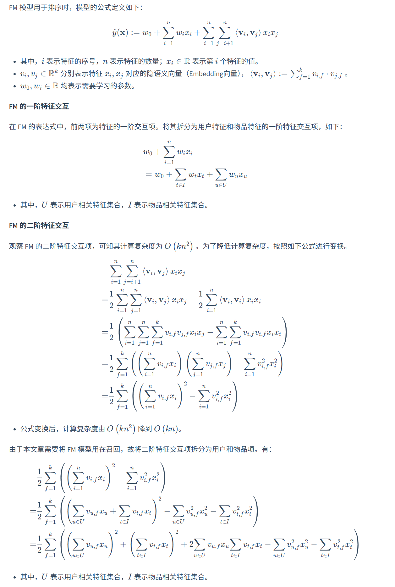 
  + 用于召回时的简化：
    + 由于召回时用户是给定的，因此只考虑**物品特征**和**用户和物品的交互特征**，具体如下。
    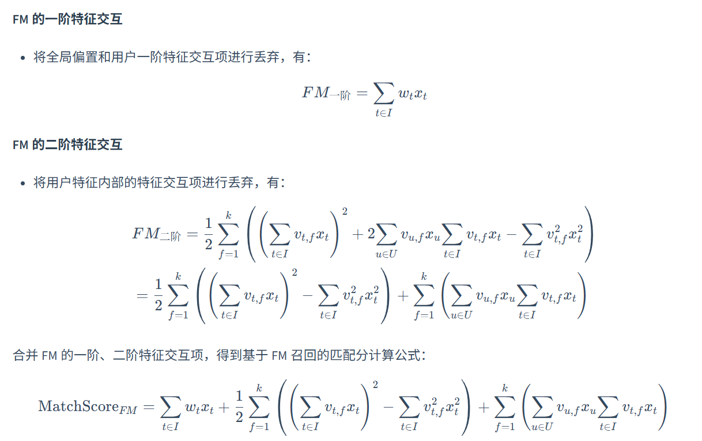
  + 样本选择 (不同于**排序**的方式)
    + 正样本：曝光且点击
    + 负样本：通过在 item 库中随机采样得到；**不可以拿曝光未点击**做负样本；有论文背书，且数据分布与真实环境不同 (**曝光未点击**既不算用户不喜欢也不算用户喜欢)；
    + 由于候选集是整个 item 库，这种采样方式让模型能够对大错特错的样本有很好的认知；
    + 在正样本采样时，要打压热门 item；这是因为正样本中大部分是热门 item，直接采样会导致在用户之间没有区分度；一种可用的降采样方式如下：
      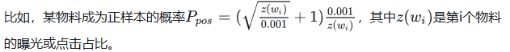
    + 在负样本采样时，要提升热门 item 但同时也要覆盖到整个样本库；一种常见的采样方式如下：
      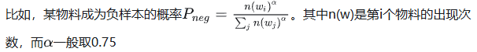
    + 但是，上述方法得到的通常是 easy-negetive 样本，需要找到一些 hard-negetive，比如说根据业务逻辑；比如说根据上次召回结果的 101-500 名定性为 hard-negetive；
      + 在线筛选：对同一个 batch 内的 <user, item+>，从中选取 **1-2** 个与 user 最接近的 item+ 作为 hard-negetive；但可能面临着数据量不够大的问题；
      + 离线筛选：过一遍 item 集合，根据上次召回结果的 101-500 名定性为 hard-negetive；
      + 比例维持在 100：1，全是 hard-negetive 并不有效；
    + 在 hard-negetive 的使用上，既可以混合使用 (迁移使用)，也可以并行使用 (加权)，也可以串行使用 (多次过滤)。
  + 特征选择上，在预测时，不能够使用任何 user 与 item 的交叉特征，否则检索速度不够快。
  + 优化目标上，使用二分类并不好 (因为 hard-negetive 是随机抽取的)；希望**正样本的得分远远大于负样本**即可。因此输入的一个样本是 <user, item+, item->，采用的损失函数可以是 PairWise LTR，也可以是 BPR (鼓励二者的差距越大越好)。
    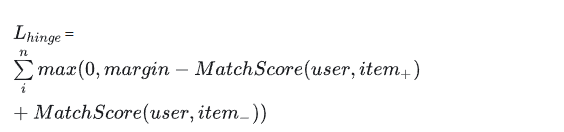
    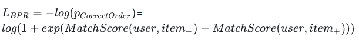
    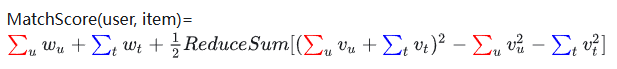
  + 线上使用时，对于同一个 user 而言，遵循如下的召回计算方式即可；
    + FM 召回对于新样本适应较好，因为至少有一个特征 new_user，样本分类也一定具有特征。
    + 不能只考虑交互项，热门 item 自身的特征对于推荐也很有帮助。
      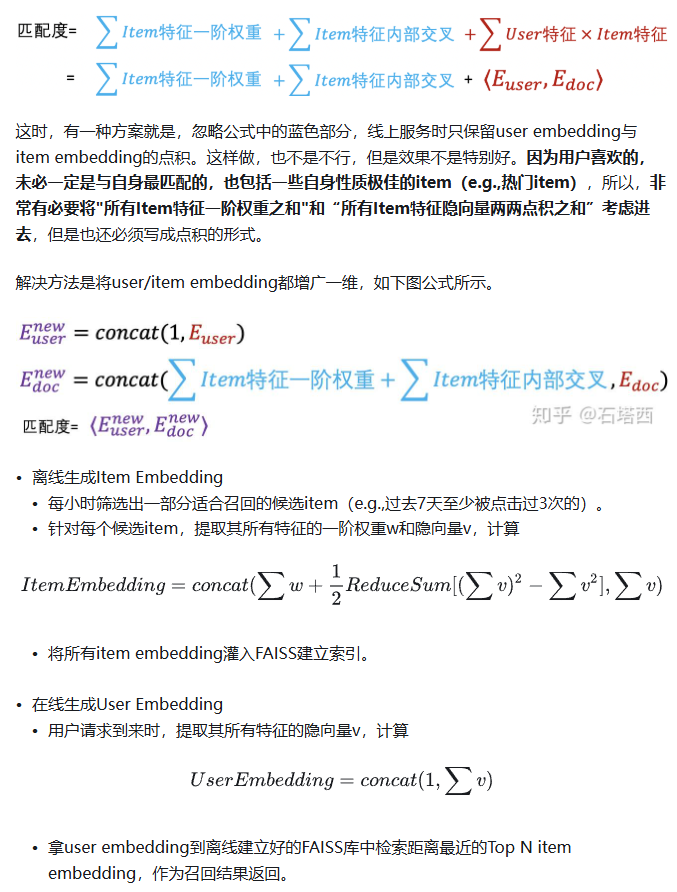
  + FM 做 embedding 的方式就是 one-hot 编码一段隐向量。

+ item2vec 召回
  + word2vec 原理 - Skip-gram
    + 给定中心词 c 的情况下，最大化周围单词 o 的出现概率；其中，概率分布使用 softmax 损失函数进行估计；
    + 注意到，分母考虑了词表的所有单词，计算量很大；且中心词与周围词使用的是两个不同的矩阵。
      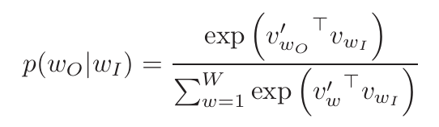
      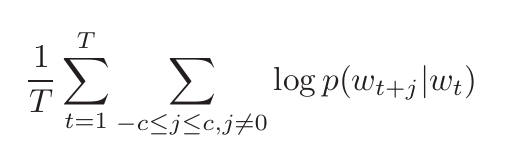
    + 考虑到词表数量过大，采用了依照频率的四分之三次方的采样的方式选择 5-20 / 2-5 个负样本；使用 NCE 损失函数 $L = log(σ(v_c · v_o)) + Σ_{i=1}^k E[log(σ(-v_c · v_{neg_i}))]$
    + 考虑到训练集中有大量的高频词 (a, the, ...)，对频繁词子采样 $P(wi) = 1 - \sqrt{(t/f(wi))}$
  + word2vec 原理 - CBOW
    + 给定周围词 ${o_i}$ 的情况下，最大化中心单词 c 的出现概率；对于多个出现的周围词，对其特征向量进行了平均；
    + 其他均与 Skip-gram 相同；
  + item2vec: 直接类比了 word2vec，将一类物品集合 (set) 替代了原本的句子 (sentence) 的概念；$L = \sum_{(i,j) \in D^+}( \log \sigma(v_i \cdot v_j) + \sum_{k=1}^{K} \mathbb{E}_{item_k \sim P_n(i)} [\log \sigma(-v_i \cdot v_k)])$

+ Airbnb 召回
  + 用户**短期**特征学习 list Embedding
    + 直接采用了 Word2Vec 的 Skip-Gram 思想，将用户的每个 session $s = (l_1, l_2, ..., l_M)$，训练其 Embedding 向量；
    + 改进：将最终预定的房间作为全局的 positive listing；负样本除了随机采样之外，在租房区域内部选择了困难的负样本。
    + 损失函数：$L = -(\sum_{(l,c) \in D_{positive}}\frac{1}{1+e^{-v_c^{'}v_l}} + \sum_{(l,c) \in D_{negetive}}\frac{1}{1+e^{v_c^{'}v_l}} + \frac{1}{1+e^{-v_{booked}^{'}v_l}} + \sum_{(l,c) \in D_{region}}\frac{1}{1+e^{-v_c^{'}v_l}})$，其中 $v_l$ 为中心 listing；
      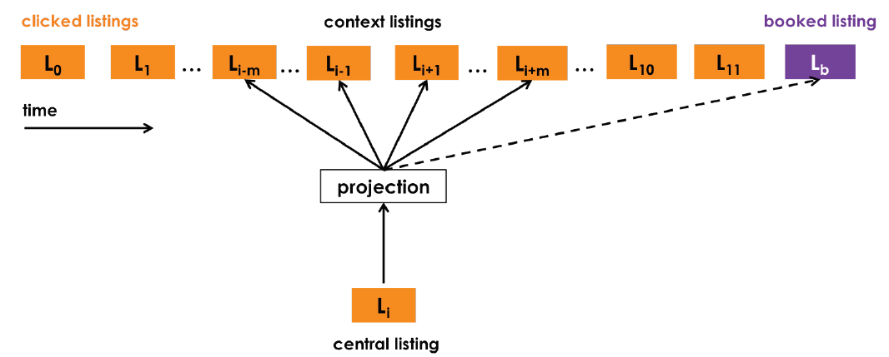
    + listing Embedding 冷启动：根据标签特征寻找相近的 listing，对其 Embedding 做均值，可以解决大部分问题；
    + 评估方式：降维 (t-SNE) / 聚类 (KMeans)，观察区域相关性、风格相关性、价格相关性等；
  + 用户**长期**兴趣学习 User-type & Listing-type Embedding
    + 存在问题：用户兴趣是基于 booking list 的，但是长度短且稀疏，难以学习；
    + 解决方式：不针对每一个 item 学习 Embedding，而是针对每一种 type 学习 Embedding，这样不同的 item 会共享一部分 Embedding；
      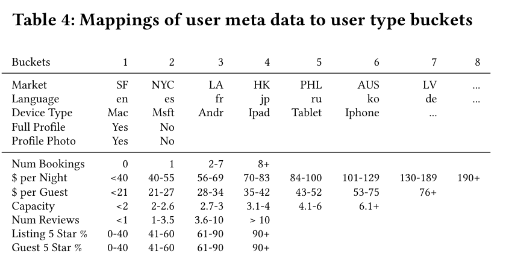
    + 输入样本：为了让 user_type 和 listing_type 处于同一个向量空间，因此需要联合训练，故训练样本 session $s = \{(u_1, l_1), (u_2, l_2), ..., (u_M, l_M)\}$；注意，user_type 和 listing type 会**随着时间发生改变**。
    + 额外负样本：用户预定但被拒绝的 listing；从而为 Embedding 加入了客户与主人的**偏好**；
    + 训练方式：同样采用 Skip-gram 的方式；$L = -(\sum_{(l,c) \in D_{booked}}\frac{1}{1+e^{-v_c^{'}v_l}} + \sum_{(l,c) \in D_{negetive}}\frac{1}{1+e^{v_c^{'}v_l}} + \sum_{(l,c) \in D_{reject}}\frac{1}{1+e^{v_c^{'}v_l}})$；其中，$l$ 既可以是 user，也可以是 listing；$c$ 包含了上下文的 user 和 listing；
      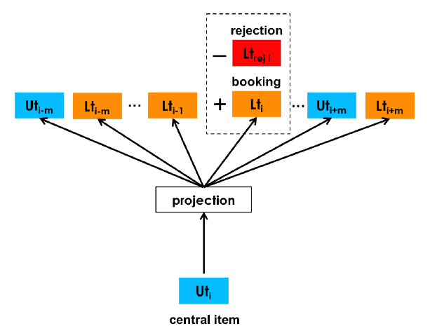
  + 召回结果的评估
    + 离线评估：整理一个候选房源的列表；用户每次点击时，计算 clicked_listing 与所有 candidate_listing 的相似度，并查看 booked_listing 在所有 candidate_listing 的排名；排名越低，说明 Embedding 的效果越好；
      + 只看 AUC 不一定好 (召回热门 item 的 AUC 一般就很高)；还要考虑新颖、互补、topK 等；
      + 拿 topK 与用户点击做交集也不一定好，因为召回的物品可能没有给用户曝光过 (没有被点击不一定用户不感兴趣)；
    + 召回结果用于排序：构建了 GBDT 模型
      + 对于召回得到的 listing，构造用户 user 与 listing 的相似度特征，用这些相似度特征进行排序；
        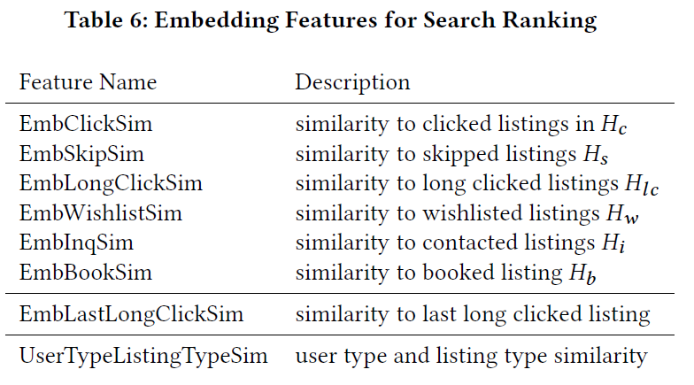

+ YoutubeDNN 召回
  + 整体模型架构：召回侧以用户的历史交互信息作为输入；排序侧融入了更多物品自身的特征信息；评估时，A/B test 是最好的标准，offline 指标可能与之存在差异；
    
  + 模型架构：以用户的交互特征作为主要输入；包括用户过去观看视频的向量平均值 (视频向量通过 word2vec 学习)、用户过去的搜索向量、用户的自身人文特征、**example age** (训练样本中的最大时间戳 $t_{max}$ 减去样本的当前时间 $t$，用于刻画视频的新颖程度，消除时间新颖性的 bias；线上推理时，将 example age 均设置为相同值即可；同理的特征构造方式还有视频发布时长、视频排序等)；训练得到用户特征；
    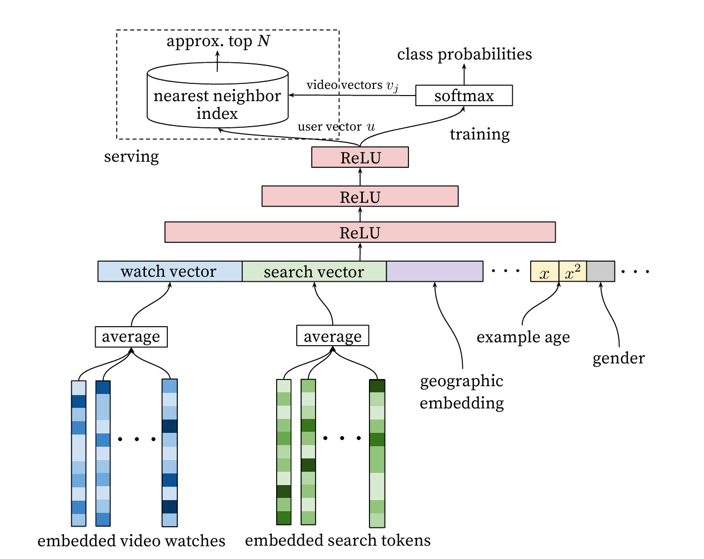
  + 训练数据选取：样本为全部视频的观看记录；正样本为观看完毕的视频 (每个样本的预测值是用户的下一个观看视频)；负样本通过随机采样得到；抛弃了时序信息 (取均值，但比较牵强)；每个用户选取的样本数量相同；序列信息只把历史信息作为输入；
    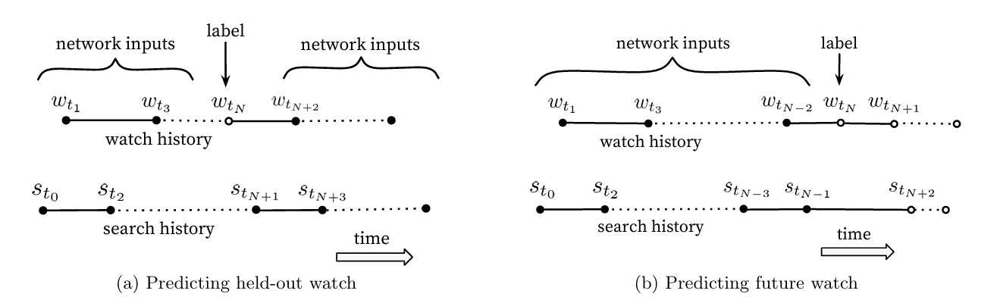
  + 结果：用户向量是网络输出；物品向量是 word2vec 的 output 向量；online 时采用近邻搜索完成召回工作；

+ 双塔模型召回
  + DSSM 双塔架构：查询塔 (query) 与文档塔 (document)
    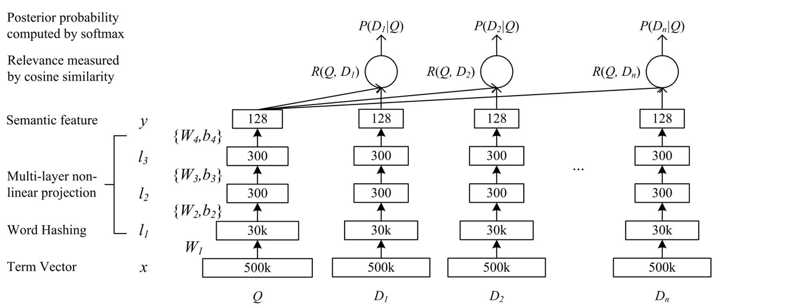
    + 具体技术： Word Hashing (现在应该已经不用了吧)
      + 对于每个单词，统计其所有 N-gram 哈希后的位置；构建一个大小为 N 的向量，向量中对应位置置为 1；结果是一个比原始 one-hot 向量维度小得多的表示；
  + 召回双塔结构：用户塔 (user) 和物料塔 (item)
    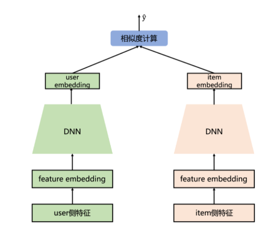
  + SENet 双塔模型：对特征进行加权 (channel 等价于不同的 feature)
    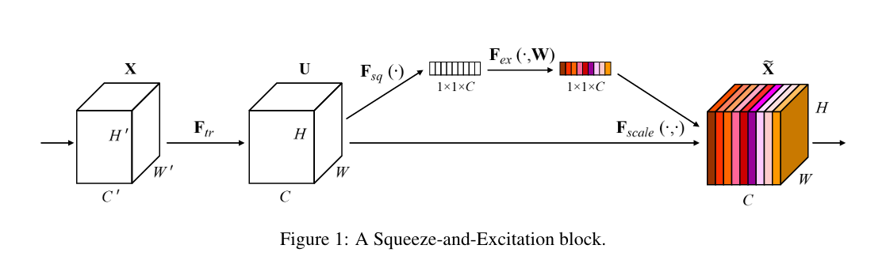
    + 由于 user 和 item 交互的位置太晚，原始特征可能会被扭曲；通过 SENet 加权，可以增加高频特征的权重，避免低频不靠谱的特征 embedding 的影响；
  + 多目标双塔模型：共享 Embedding 参数，其他系数分别训练；
  + Youtube 双塔模型：主要解决采样带来的偏差
    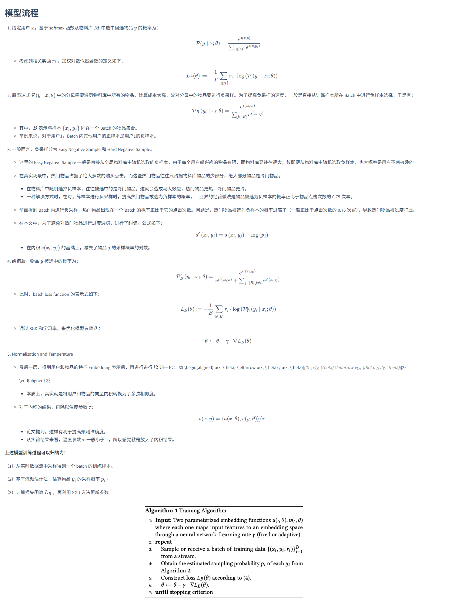
    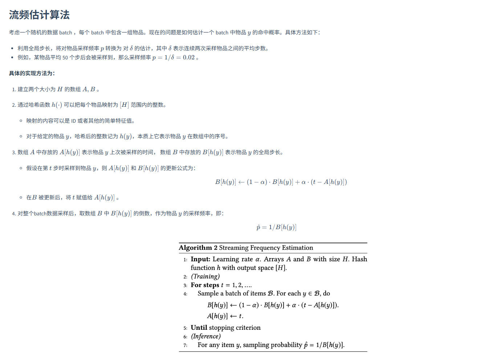
    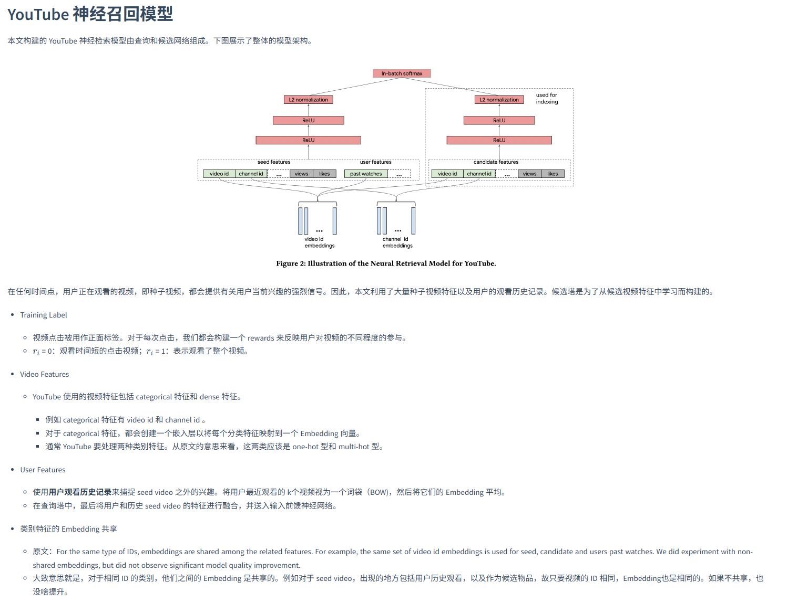
    + 技巧点：重要性采样，将 in-batch 损失逼近全局损失；最上层 embedding 的归一化，使得内积大小关系 (训练时) 与距离大小关系 (推理时) 相同；温度系数增加相似度范围；
    + 这是一个类似于 item2item 的双塔，用于视频的相关推荐当中。