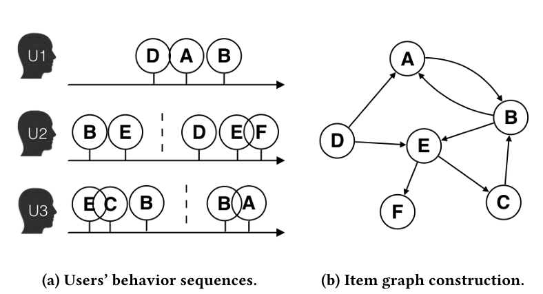
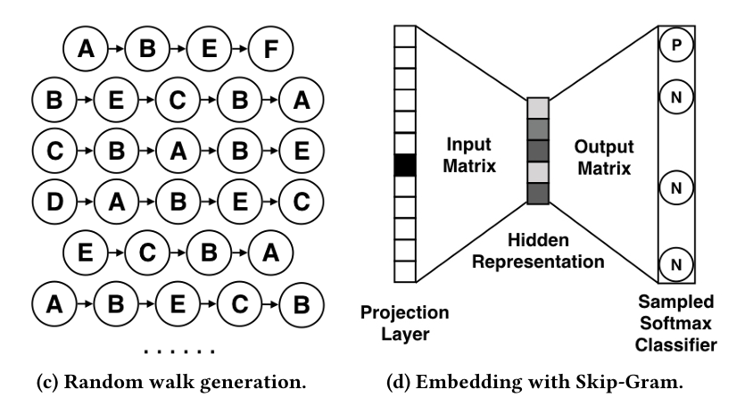
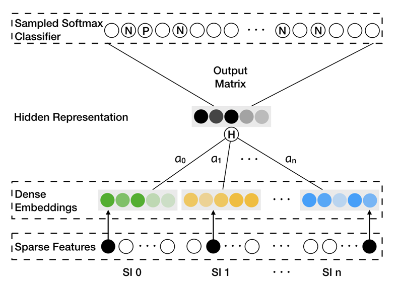
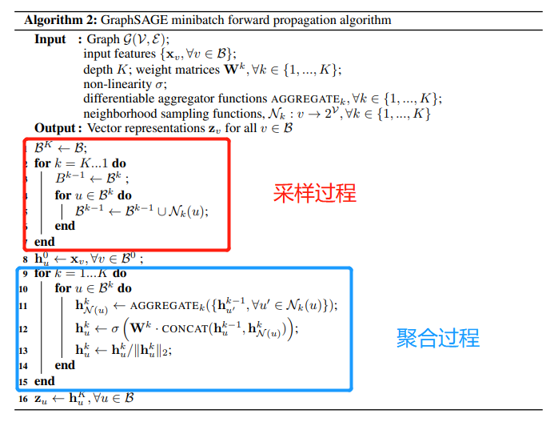
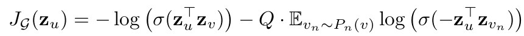
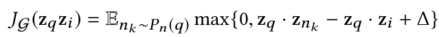

# 搜广推 day4

## 基于图的召回

+ Billion-scale Commodity Embedding for E-commerce Recommendation in Alibaba
  + 主要动机：解决规模可扩展性 (Scalability)，稀疏性 (Sparsity)，冷启动 (Cold Start)；
  + 解决方啊：构建 item2item 的召回模型，利用用户的历史交互信息构建 graph，学习物品之间的 pairwise similarity；
  + Item Graph 构建
    + 选取一段时间的用户交互记录 (1 小时)，依据点击物品的**先后顺序**构建 item 有向图；边的权重预先给定，即为转移的频率；
    + 排除异常数据：删除停留时间过少的 click；删除频繁用户的记录；删除异常 item 的记录；
    + 相较于传统 itemCF 的优势：考虑了 click 序列顺序的影响；
        
  + Base Graph Embedding
    + 使用 DeepWalk 算法获取 item Embedding；具体而言，通过 RandomWalk 获取多条转移轨迹，并通过 Skip-Gram 的方式完成 item Embedding；为了计算加速，采用了 negetive sampling；
    + maximize $log\ \sigma(\Phi(v_j)^T \Phi(v_i)) + \Sigma_{t \in N_{beg}}\sigma(-\Phi(v_j)^T \Phi(v_t))$
        
  + Graph Embedding with Side Info
    + 只在 Embedding 的过程中存在差异，将 type 等特征信息进行 Embedding，并与 item 自身进行平均；
    + 解决了冷启动面临的问题；
        
  + Enhanced Graph Embedding with Side Info
    + 对所有特征取平均并不合理，不同特征的重要性应该不同；因此添加了重要性矩阵 $A^{|V|*(n+1)}$，刻画特征的重要性；
    + 具体的加权方式为 $H_v = \frac{\Sigma_{j \in Side} e^{a_v^j}{W_v^j}}{\Sigma_{j \in Side}}$
    + 仍然采用了 negetive sampling 的方式进行加速，对于中心 item $v$，正样本或者负样本 $v$，优化 $L = -[ylog(\sigma(H_v^T Z_u)) + (1-y)log(\sigma(-H_v^T Z_u))]$
+ GraphSage
  + 创新点：GCN 要求图结构不可改变，而 GraphSage 可以应对训练时未出现的节点；
  + 节点特征计算方式：
    
    + $N_k(u)$ 是节点 $u$ 采样过后的邻居节点 (所有节点的邻居均匀采样相同数量)；
  + 损失函数：使用无监督学习，希望临近节点具有相似的 Embedding 表示；
    
    + 正样本通过 fix-depth RandomWalk 获得；负样本随机采样得到；
  + 优势点：适用于新增节点的 Embedding 学习；训练和推理时 batch 大小固定；
+ Graph Convolutional Neural Networks for Web-Scale Recommender Systems
  + 创新点：将 GraphSage 应用于推荐系统，解决新节点的问题；
  + 训练与推理方法：基本与 GraphSage 保持一致；
    + 图的构建上，采用了 user-item 二部图；
    + 邻居样本的选择上，采用 importance pooling，使用随机游走的方式寻找邻居节点；
    + 负样本采样与渐进训练；
  + 损失函数使用 pairwise margin loss；$z_q$ 和 $z_i$ 为 query 和 corresponding item；$z_{n_k}$ 为 negetive sample；
    