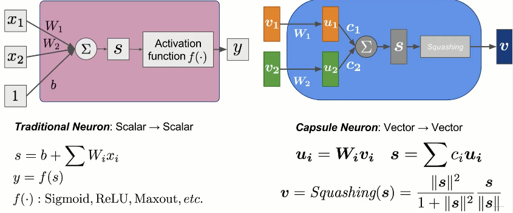
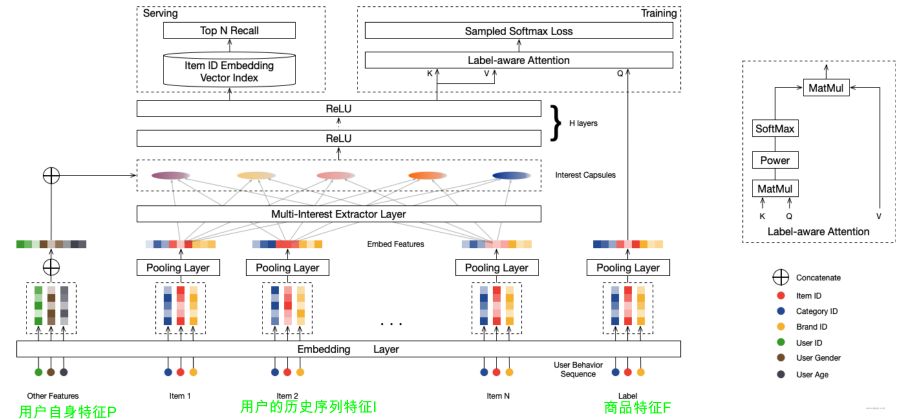
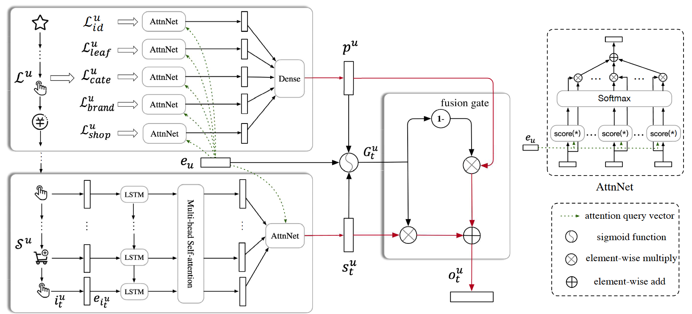
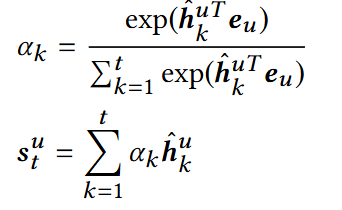

# 搜广推 day5

## 基于序列的召回

+ Multi-Interest Network with Dynamic Routing for Recommendation at Tmall
  + 背景： 用户的历史交互中，经常体现出“多兴趣” 的现象，如果只聚合成为一个向量，无法表征这种现象；如果加入 attention 机制又会使得计算复杂度提高；因此希望得到用户的多个兴趣向量；
  + 胶囊网络与动态路由机制 (vector to vector)
    
    + 目标：通过迭代式的计算方式，使得胶囊网络的输出向量聚合到相似的输入向量，排除异常输入向量；
    + $c_i$ 的更新：$(c_i^r) = softmax(b_i^{r-1})$; $b_i^r = b_i^{r-1} + a^r * u^i$;
  + 任务目标：给定 $input = (I_u, P_u, F_i)$，其中 $I_u$ 是与用户有交互的 item 向量，$P_u$ 是用户自身的属性，$F_i$ 是目标 item 的属性特征；希望学习到 $V_u = f_{user}(I_u, P_u) = (v_u^1, ..., v_u^K) \in R^{d * K}$，表示用户的 K 个兴趣向量，以及 $e_i = f_{item}(F_i) \in R^{d * 1}$，表示 item 向量，通过 $f_{score}(V_u, e_i) = \max\limits_{1 \leq k \leq K} e_i^T v_u^k$ 计算匹配度。
  + 网络结构
    
    + 多兴趣提取层 (Capsule Network)
      + 共享映射矩阵 $S$，由于是 Behavior -> Interest 的映射，使用同一个矩阵有利于让映射得到的兴趣向量处于同一个向量空间；
      + 随机初始化路由对数：避免所有的用户兴趣均相同；
      + 动态兴趣数量：$max(1, min(K, log(|I_u|)))$；
      + 在实际操作中，将用户的个人特征拼接到了每一个兴趣特征上；
    + Label Aware Attention (注意力层)
      + $v_u = Attention(e_i, V_u, V_u) = V_u softmax(pow(V_u^T e_i, p))$
      + 通过调节 $p$ 的大小可以控制聚焦重要胶囊 / 注意力平均化
    + 负采样后的损失函数

+ SDM: Sequential Deep Matching Model for Online Large-scale Recommender System
  + 背景：用户的行为序列信息很重要，需要同时利用好**长期行为**和**短期偏好**，并进行融合，提取出真正有用的兴趣信息；
  + 任务：给定 $U$ 用户集合和 $I$ 商品集合，判断在时刻 $t$ 用户 $u$ 是否会点击 item $i$；
  + 网络架构
    
    + 输入：短期会话 $S^u$ 以及长期会话 $L^u$，其中长期会话不包含短期会话
      + 会话 session 可以根据时间进行切分 (10 min)；
      + 过长的会话会被切分为两段 (交互的物品数量小于 50)；
    + 特征整合：对于 item 以及 user 的不同特征，均采用了 concat 的方法进行聚合；
    + 短期会话 $S^u$ 兴趣提取
      + 使用了标准的 LSTM 网络结构提取短期兴趣；
      + 使用**多头**注意力 (MHA) 聚合用户的短期**多兴趣**特征；
      + 考虑到历史行为相似的用户在偏好上可能存在差异，因此使用 User Attention 提取**该用户**的短期兴趣；
        
    + 长期会话 $L^u$ 兴趣提取
      + 用户的长期兴趣可能体现在不同的维度上，因此将 $L^u$ 进行切分成为多个序列，包括 $L_{id}^u$ item 序列、$L_{leaf}^u$ 细类别序列、$L_{cate}^u$ 大类别序列、$L_{shop}^u$ 店铺序列、$L_{brand}^u$ 品牌序列，对各个序列分别进行建模；
      + 对每个序列，分别执行上述的 User Attention 获得用户在**不同维度**的长期兴趣；并通过拼接映射成为一个向量；
    + 长短期兴趣融合
      + 为了融合长短期兴趣，引入了门控机制，用来评价不同维度上长短期兴趣的重要程度；
        $G_t^u = sigmoid(W^1 e_u + W^2 s_t^u + W_3 p^u + b)$
        $o_t^u = (1 - G_t^u) * p^u + G_t^u * s_t^u$ 
    + 一些评价指标 (Offline)
      + HitRate@K = $\frac{真正点击数量}{推荐商品数量}$
      + Precision@K(u) = $\frac{|召回商品 \cap 用户真正感兴趣的商品|}{K}$
      + Recall@K(u) = $\frac{|召回商品 \cap 用户真正感兴趣的商品|}{|用户真正感兴趣的商品|}$
      + F_1@K(u) = $\frac{1}{\frac{1}{Precision@K(u)} + \frac{1}{Recall@K(u)}}$
    + 一些评价指标 (Online)
      + pCTR (Click-Through-Rate per page view) = number of clicks / number of pages
      + pGMV (Gross Merchandise Volume per 1,000 page views) = 1000 * pay amount / number of pages
      + discovery (how novel) = number of new categories / all categories