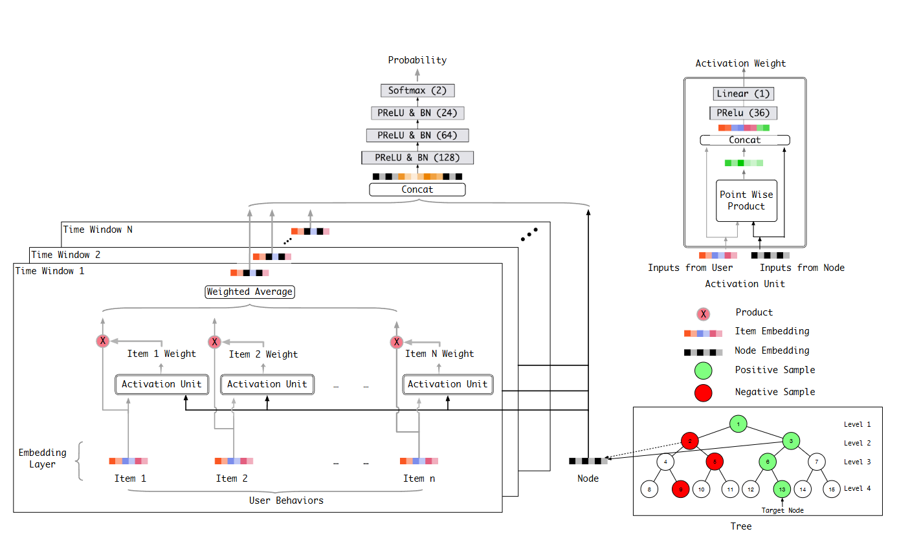

# 搜广推 day6

## 基于树模型的召回

+ Learning Tree-based Deep Model for Recommender Systems
  + 动机：内积的直接检索方式过于直接，效果不如借助更为复杂的方式；而复杂的方式面临计算开销过大；因此提出树模型对商品进行 indexing，实现 log(N) 级别的高效检索；
  + 训练过程：
    + 将 Item 利用 KMeans 聚类为树 -> 根据树构造训练样本 -> 训练模型 -> 更新树节点的 Embedding
      
    + 树的叶子节点表示 item；被选择过的 item 编码为 1，同层的其余编码为 0；正样本的父节点均为编码为 1；
  + 推理过程：对整个树进行逐层级的束搜索
    + 搜索初始化：
      + 从根节点开始，将其加入优先队列
      + 设置束宽 Beam Width (B)，控制每层保留的最大节点数
    + 层次检索过程：
      + 对于当前层的每个节点，使用深度模型预测用户对其所有子节点的兴趣得分
      + 从所有子节点中选择得分最高的 B 个节点，加入下一层的候选集
      + 重复此过程，直到达到叶子节点层