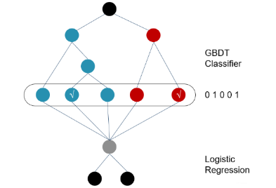

# 搜广推 day7

## 经典排序模型 GBDT + LR

+ GBDT + LR
  + 目标：LR 模型对 id 类特征适应较好，但需要人工构造特征，且无法处理非线性数据；GBDT 可以自动进行多特征组合，但处理大量特征时需要大量内存；因此需要互补二者的能力。
  + GBDT 用于二分类算法
    + 损失函数：交叉熵损失函数 $L(\theta) = -\sum_i(y_i log(p_i) + (1 - y_i) log(1 - p_i))$
    + 模型构建：$F_t = \sum_i \alpha_i h_i + u_t = v_t + u_t$
      + 代入 $p_i = \frac{1}{1 + e^{-F(x_i)}}$，损失函数改写为：$L(\theta， F_{t-1}) = \sum_i(y_i log(1 + e^{-F_{t-1}}) + (1 - y_i)(F_{t-1} + log(1 + e^{-F_{t-1}})))$
    + 拟合目标为负梯度：$-\frac{dL}{dv_t} = \sum_i \frac{y_i}{1 + e^{-v_t}} - (1 - y_i) + \frac{1 - y_i}{1 + e^{-v_t}} = \sum_i (y_i - \frac{1}{1 + e^{-v_t}})$
    + 用新的树逼近拟合目标，转化为回归问题；
  + GBDT 结合 LR
    
    + 首先利用原始数据和 label，训练得到 GBDT 梯度提升树；
    + 对于每一个训练样本，需要得到其落在 GBDT 的**哪些叶子**上，作为 0/1 特征输入到 LR 模型中；
    + 再利用 LR 对新构造的特征进行训练；
    + 注意事项：
      + 对于 GBDT，一般 id 类特征单独建树 (细粒度)，非 id 类特征建树 (粗粒度)
      + 在 LR 过程中，原始特征也加入了训练；
      + 对于 one-hot 特征，逻辑回归会比 GBDT 更好一些，因为高维稀疏特征可能已经可以线性可分，且加入正则项后防止过拟合的效应更强；
